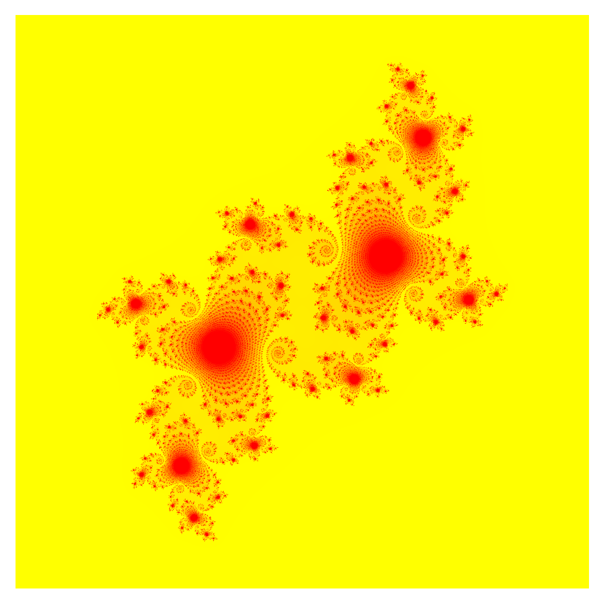

parallel computing of julia fractals ✨



# benchmark results

<br><br><br>

# system specs

the system used for benchmarking was a hydra node with the following specs:

```plaintext
bopc23s9@hydra-head:~$ lscpu

Architecture:                    x86_64
CPU op-mode(s):                  32-bit, 64-bit
Byte Order:                      Little Endian
Address sizes:                   46 bits physical, 48 bits virtual
CPU(s):                          16
On-line CPU(s) list:             0-15
Thread(s) per core:              1
Core(s) per socket:              16
Socket(s):                       1
NUMA node(s):                    1
Vendor ID:                       GenuineIntel
CPU family:                      6
Model:                           85
Model name:                      Intel(R) Xeon(R) Gold 6130 CPU @ 2.10GHz
Stepping:                        4
CPU MHz:                         1000.151
CPU max MHz:                     3700.0000
CPU min MHz:                     1000.0000
BogoMIPS:                        4200.00
L1d cache:                       512 KiB
L1i cache:                       512 KiB
L2 cache:                        16 MiB
L3 cache:                        22 MiB
NUMA node0 CPU(s):               0-15
...
```

# development

_installing openmp_:

-   see: https://stackoverflow.com/a/29109926/13045051
-   see: https://mac.r-project.org/openmp/

```bash
xcode-select --install
brew install llvm libomp cmake gcc
gcc --version # ignore this version, v15 didn't work for me
brew list --versions gcc # this is the right one

filename="scheduler"
gcc-14 -fopenmp -o ./docs/demo/$filename ./docs/demo/$filename.c && ./docs/demo/$filename && rm -rf ./docs/demo/$filename
```

_executing SLURM jobs on the TU Wien hydra cluster_:

-   create the binary on the machine you want to run it on - otherwise the binary will be compiled for the wrong architecture. on arm64, make sure to compile with `cmake -DCMAKE_C_COMPILER=/opt/local/bin/gcc-mp-13` or similar.
-   delete `CMakeCache.txt`
-   give `./bin` exec permissions
